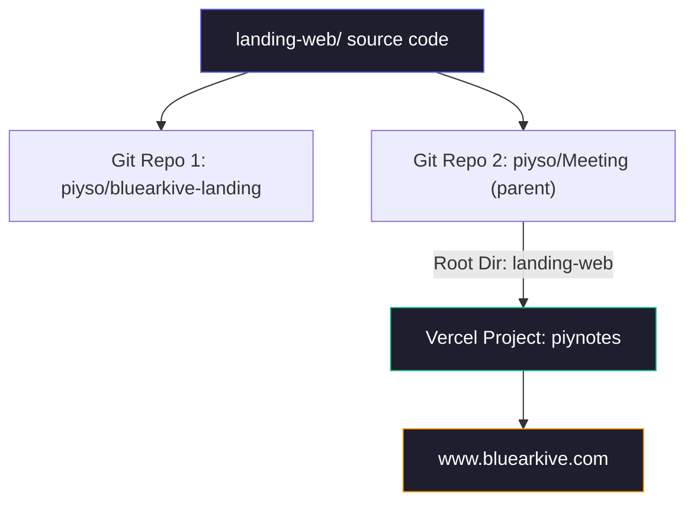

# BlueArkive Landing Page — Deployment Architecture

> [!IMPORTANT]
> **ALWAYS use `./deploy.sh` from the `landing-web/` directory to deploy.** Never rely on git push alone.

## Architecture Overview



## Key Facts

| Component | Value |
|---|---|
| **Production URL** | `https://www.bluearkive.com` |
| **Vercel Project** | `piynotes` |
| **Vercel Org** | `piysos-projects` |
| **Deployment Source** | Parent repo `piyso/Meeting`, root dir `landing-web` |
| **Vercel Auto-Deploy** | ❌ Not reliable — use CLI `vercel --prod` |
| **Landing Standalone Repo** | `piyso/bluearkive-landing` (backup, not used by Vercel) |

## Why Two Git Repos?

`landing-web/` is a **nested independent git repository** inside `piyso/Meeting`. It is **NOT** a git submodule (no `.gitmodules` exists). Both repos track the same source files independently:

- **`piyso/Meeting`** — the Electron app parent repo. Tracks `landing-web/` files directly.
- **`piyso/bluearkive-landing`** — standalone repo for the landing page only.

## Deployment Pipeline

### Quick Deploy (recommended)
```bash
cd landing-web
./deploy.sh "feat: my changes"
```

This handles everything: build check → commit both repos → push both → deploy to Vercel.

### Manual Deploy
```bash
# 1. From landing-web/ — commit and push standalone repo
cd landing-web
git add -A && git commit -m "message" && git push origin main

# 2. From parent/ — commit and push parent repo
cd ..
git add landing-web/ && git commit -m "message" && git push origin main

# 3. From parent/ — deploy to Vercel (REQUIRED — auto-deploy is broken)
npx vercel --prod --yes
```

> [!CAUTION]  
> Pushing to `piyso/bluearkive-landing` alone does **NOT** deploy. Pushing to `piyso/Meeting` alone does **NOT** auto-deploy. You **MUST** run `vercel --prod` from the parent directory.

## Vercel Configuration

- **Parent `.vercel/project.json`** — points to Vercel project `piynotes`
- **Parent `.vercelignore`** — excludes Electron source (`/src`, `/build`, `*.dmg`, etc.)
- **`landing-web/vercel.json`** — SPA rewrite rule (`/(.*) → /`)
- **`landing-web/.vercel/`** — local dev config only (gitignored)

## Environment Variables

Stored in `landing-web/.env` and `.env.local` (gitignored). Must also be set in Vercel dashboard under Project Settings → Environment Variables.
